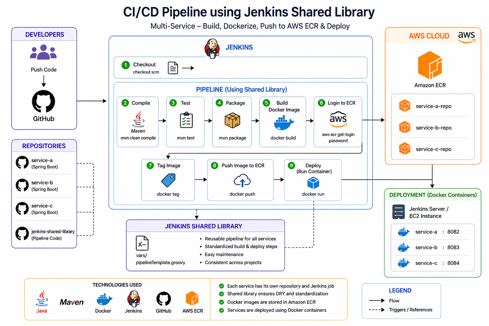
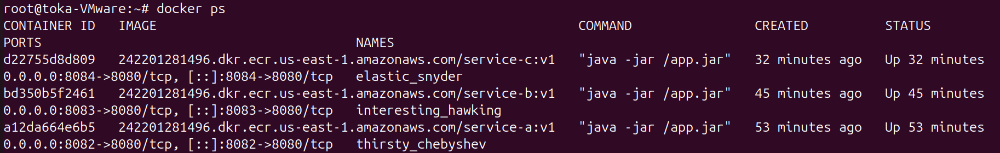
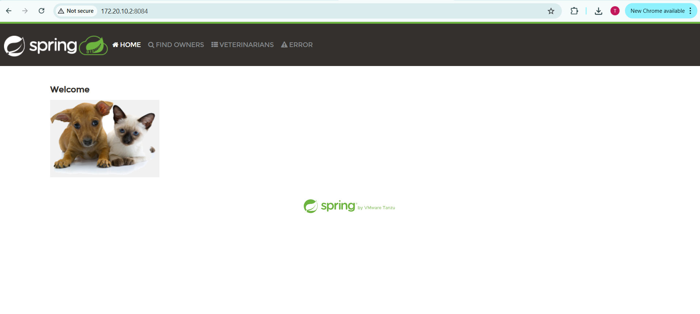

# 🚀 Microservices CI/CD Pipeline with Jenkins Shared Library

A complete **end-to-end CI/CD pipeline** for microservices using a **Jenkins Shared Library**.
This project demonstrates how to automate the full lifecycle from **code commit → build → containerization → deployment on AWS ECR**.

---

## 📌 Architecture Overview



### 🔗 Components Explained

* GitHub
  Hosts the source code for each microservice and triggers the pipeline via webhook.

* Jenkins
  Executes the CI/CD pipeline and orchestrates all stages.

* Jenkins Shared Library
  Contains reusable pipeline logic (`pipelineTemplate.groovy`) to avoid duplication.

* Docker
  Builds container images and runs services as containers.

* Amazon ECR
  Stores Docker images securely in the cloud.

* Deployment Server (VM / EC2)
  Runs the final containers and exposes applications on different ports.

---

## ⚙️ How the Pipeline Works (Detailed Flow)

1. Developer pushes code to a service repository
2. GitHub webhook triggers Jenkins automatically
3. Jenkins loads the shared library
4. The pipeline starts executing stages:

   * Build & test the application
   * Package the JAR file
   * Build Docker image
   * Authenticate with AWS ECR
   * Push image to ECR
   * Deploy container
5. Application becomes accessible via browser

---

## 🧾 Jenkinsfile (Per Service)

```groovy
@Library('jenkins-shared-library') _

pipelineTemplate(
    imageName: 'service-a',
    imageTag:  'v1.0',
    port:      '8082',
    region:    'us-east-1',
    accountId: '123456789012',
    ecrRepo:   'service-a'
)
```

---

## 🔧 Dynamic Parameters (Explained)

| Parameter | Description                                |
| --------- | ------------------------------------------ |
| imageName | Name of the Docker image                   |
| imageTag  | Version of the image                       |
| port      | Host machine port (used to expose service) |
| region    | AWS region where ECR is hosted             |
| accountId | AWS account ID                             |
| ecrRepo   | Name of ECR repository                     |

---

## 🏗️ Pipeline Stages (Step-by-Step)

| # | Stage        | Description                            |
| - | ------------ | -------------------------------------- |
| 1 | Checkout     | Retrieves source code from GitHub      |
| 2 | Compile      | Compiles Java code using Maven         |
| 3 | Test         | Runs unit tests to ensure code quality |
| 4 | Package      | Builds the `.jar` file                 |
| 5 | Docker Build | Creates Docker image                   |
| 6 | Login to ECR | Authenticates using AWS CLI            |
| 7 | Tag Image    | Tags image for ECR                     |
| 8 | Push Image   | Pushes image to ECR                    |
| 9 | Deploy       | Runs container on server               |

---

## 📦 Microservices & Ports

| Service   | Port | Access URL            |
| --------- | ---- | --------------------- |
| service-a | 8082 | http://localhost:8082 |
| service-b | 8083 | http://localhost:8083 |
| service-c | 8084 | http://localhost:8084 |

---

## 🧩 Shared Library Structure

```text
jenkins-shared-library/
├── vars/
│   └── pipelineTemplate.groovy
└── README.md
```

---

## 🔧 Jenkins Setup (Detailed)

### 1. Register Shared Library

Go to:
`Manage Jenkins → System → Global Pipeline Libraries`

| Field           | Value                                                 |
| --------------- | ----------------------------------------------------- |
| Name            | jenkins-shared-library                                |
| Default Version | main                                                  |
| Repository      | https://github.com/toka863/jenkins-shared-library.git |

---

### 2. Create Pipeline Job

* New Item → Pipeline
* Definition → Pipeline script from SCM
* Repository → Service repo
* Branch → `main`
* Script Path → Jenkinsfile

---

### 3. Add AWS Credentials

| Field | Value           |
| ----- | --------------- |
| Kind  | AWS Credentials |
| ID    | aws-creds       |

---

## ☁️ AWS ECR Setup

1. Create repositories:

   * service-a
   * service-b
   * service-c

2. Example Repository URI:

```
123456789012.dkr.ecr.us-east-1.amazonaws.com/service-a
```

---

## 🐳 Deployment Strategy

Each service runs as an isolated Docker container:

```bash
docker run -d -p HOST_PORT:8080 IMAGE
```

Example:

```bash
docker run -d -p 8082:8080 service-a
```

---

## 🧪 Verification & Testing

### ✅ 1. Check Running Containers




Command used:

```bash
docker ps
```

---

### ✅ 2. Verify Application in Browser





Test URLs:

* http://localhost:8082
* http://localhost:8083
* http://localhost:8084

---

## 🛠️ Technologies Used

| Tool       | Purpose            |
| ---------- | ------------------ |
| Jenkins    | CI/CD automation   |
| Groovy     | Pipeline scripting |
| GitHub     | Source control     |
| Maven      | Build tool         |
| Docker     | Containerization   |
| Amazon ECR | Image registry     |
| AWS CLI    | Authentication     |
| Java 17    | Runtime            |

---

## 💡 Key Concepts Demonstrated

* ✅ Reusable Shared Library
* ✅ Dynamic pipeline parameters
* ✅ Multi-service CI/CD
* ✅ Docker-based deployment
* ✅ AWS integration
* ✅ Automated testing

---

## 🚀 Future Improvements

* Kubernetes (EKS) deployment
* CI/CD pipeline monitoring
* Auto-scaling services
* Blue/Green deployment strategy

---

## 👩‍💻 Author

Built as a hands-on DevOps lab to demonstrate real-world CI/CD practices.
