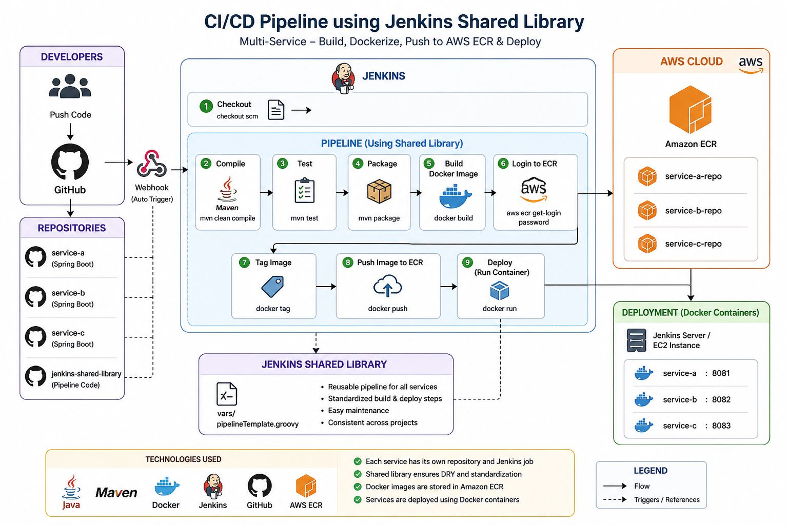

# 🚀 CI/CD Microservices Pipeline Project

---

## 📌 Overview
This project demonstrates an end-to-end CI/CD pipeline using Jenkins, Docker, and GitHub.  
It follows a multi-service architecture with a centralized Jenkins Shared Library to reuse pipeline logic.

---

## 🏗️ Architecture

---

## 🧰 Tech Stack
- Jenkins → CI/CD automation  
- Docker → Containerization  
- GitHub → Source control  
- Maven → Build tool  
- Linux → Deployment environment  

---

## 📁 Project Structure
service-a/
service-b/
service-c/
shared-library/
architecture/
docs/

---

## ⚙️ Jenkins Shared Library
A centralized pipeline library is used to:
- Build applications  
- Run tests  
- Build Docker images  

This reduces duplication and improves maintainability across services.

---

## 🔄 CI/CD Flow
1. Code pushed to GitHub  
2. Jenkins triggers pipeline  
3. Build stage (Maven)  
4. Test stage (JUnit)  
5. Docker image build  
6. Deployment  

---

## 🚀 Key Features
- Multi-service architecture  
- Reusable Jenkins Shared Library  
- Automated CI/CD pipeline  
- Dockerized applications  
- Clean DevOps workflow  

